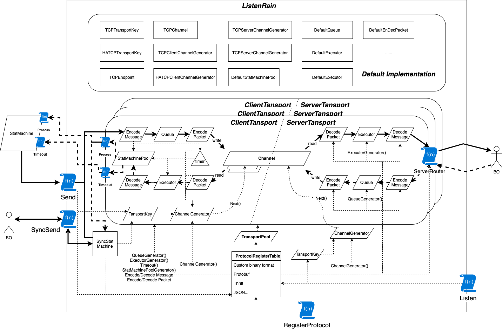

# ListenRain

Go network programming framework, supports multiplexing, adopts full-duplex working mode, supports synchronous and asynchronous request mode, modular design, and provides flexible custom interfaces. The key is the transport layer, the application layer protocol has nothing to do.

# Applicable scene

- Business needs change quickly
- Data flow (forwarding plane) service
- Need to customize the transmission protocol
- Sensitive to GC

# Architecture 

The parallelogram represents the interface. It can be seen from the figure that the interface is fully reused on both the server and the client. A brief introduction to the functions of the next few interfaces:

- EncodePacket/DecodePacket: Responsible for solving the sticky packet problem of data receiving and sending. Through this interface, memory can be reclaimed when sending and receiving data, or memory can be allocated from the memory pool, providing more options for performance optimization (such as reducing GC). Refer to [benchmark](example/benchmark) test.
- Queue: Responsible for queuing the packets to be sent.
- Executor: Go routine pool used to execute callbacks.
- EncodeMessage/DecodeMessage: Responsible for the serialization and deserialization of data, through the interface to standardize and standardize the behavior of serialization and deserialization, making the process more flexible and extensible. Users can not only define the communication protocol by themselves, but can also use it as long as they like. Some popular communication protocols, such as Protobuff, Thrift, json, etc.
- Channel:Channel is responsible for providing reliable data streams, but it has nothing to do with the specific implementation. In other words, listenrain can support reliable transport layer protocols like TCP and SCTP, and can also support QUIC, a reliable transport protocol based on UDP, and can also support Unix Socket, FIFO, even mock test based on in-process communication technology.
- ChannelGenerator:This interface is responsible for generating channels, through which scenarios such as high availability and TCP Listen can be realized.
- TransportKey: TransportKey is the only index to the access point, so it can simulate access points under different Channel implementations.
- TransportPool: Responsible for managing the Transport pool.
- StatMachine: StatMachine standardizes listenrain's callbacks, allowing users to organize their own business logic through a state machine, making the entire code structure clearer, and of course, you can also use the unconstrained synchronization request SyncSend.
- StatMachinePool: Obviously it is a pool of state machine maintenance.

For these interfaces, TCP communication-based implementations and very simple Executor and Queue implementations have been provided in the default implementations. Benchmark tests are currently also carried out using these default implementations. Of course, if users can have a better implementation, welcome to discuss them together.Also introduce other non-interface key components:

- ProtocolRegisterTable: This is the table used to register the protocol. The protocol needs to be associated with specific serialization and deserialization implementations, to solve the implementation of sticky packets, to generate the implementation of reliable streams, etc.
- timer: Similar to the timer function of the well-known network communication framework libevent, the implementation principle is also similar, and it is also implemented based on a small top heap.
- SyncStatMachine: The listenrain itself is designed by event-driven, so the business code needs to be asynchronous, but considering that some complex business logic is very complicated in asynchronous scenarios, so listenrain provides a synchronous request method, and SyncStatMachine is simulated inside the framework Callback, so that the user calling SyncSend, it looks like a synchronization request.

# Benchmarks

Code: [benchmark](example/benchmark)

Hardware environment: 

- OS: macOS Big Sur(11.2)
- Chip: Apple M1
- RAM: 16 GB

### Single TCP connection test

| parallel | payload size(KiB) | tps   | bandwith(Gib/s) | cpu(%) | mem(MiB) |
| -------- | ----------------- | ----- | --------------- | ------ | -------- |
| 1        | 4                 | 27500 | 0.911           | 132    | 48       |
| 4        | 4                 | 50000 | 1.638           | 255    | 100      |
| 16       | 4                 | 60000 | 1.966           | 275    | 157      |
| 1        | 32                | 18000 | 4.719           | 172    | 42       |
| 4        | 32                | 36000 | 9.437           | 263    | 84       |
| 16       | 32                | 34000 | 8.912           | 310    | 86       |
| 1        | 256               | 8400  | 17.616          | 176    | 32       |
| 4        | 256               | 9200  | 19.293          | 265    | 36       |
| 16       | 256               | 8300  | 17.406          | 245    | 40       |
| 1        | 4096              | 760   | 25.501          | 190    | 82       |
| 4        | 4096              | 550   | 18.455          | 260    | 132      |
| 1000     | 4096              | 550   | 18.455          | 255    | 4259     |

> *The interface implementation of the test process basically adopts the default implementation*

# Notice

The listenrain processing request needs to use its `msgID` as its unique index, so it does not currently support the repeated use of `msgID` in a short period of time (within the request response period)

# Who is using

[s3proxy](https://git.x.com/epoch/s3/s3proxy) : Implementation of s3 protocol, back-end docking with x object storage bottom layer

